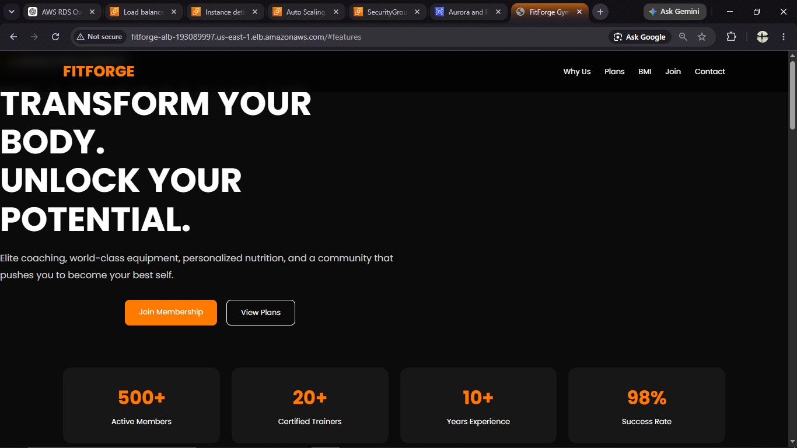
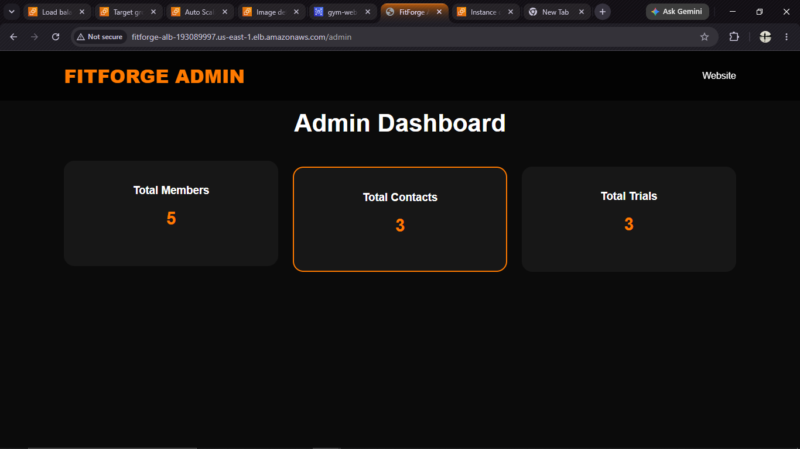
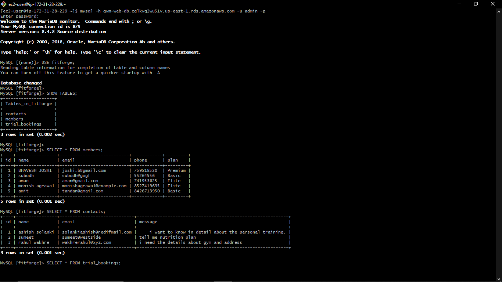
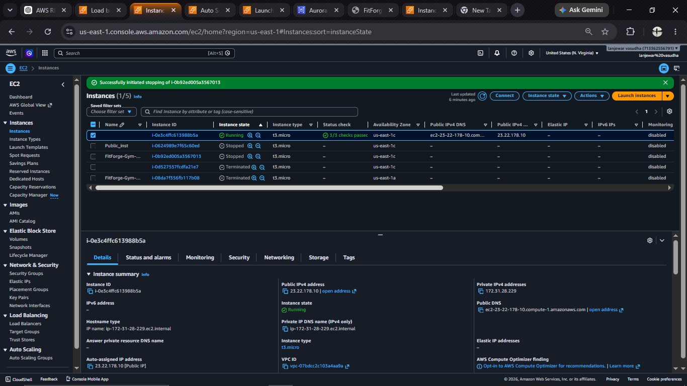
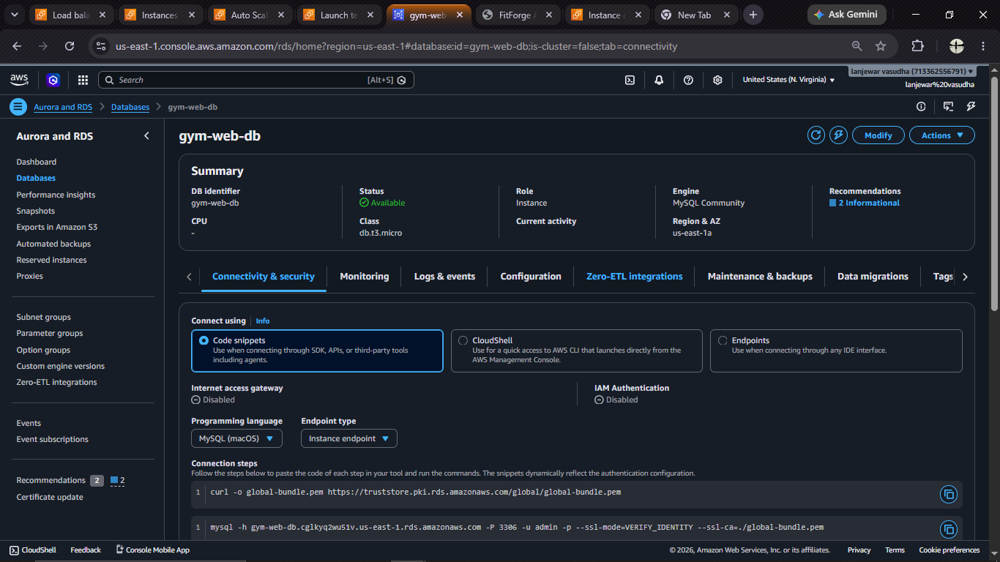
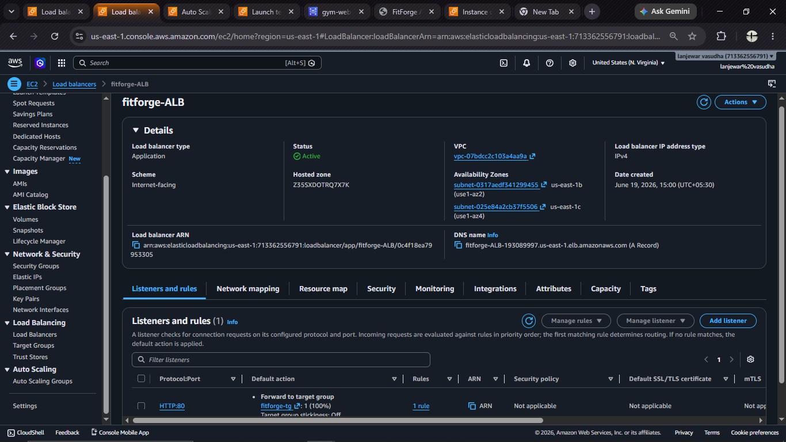
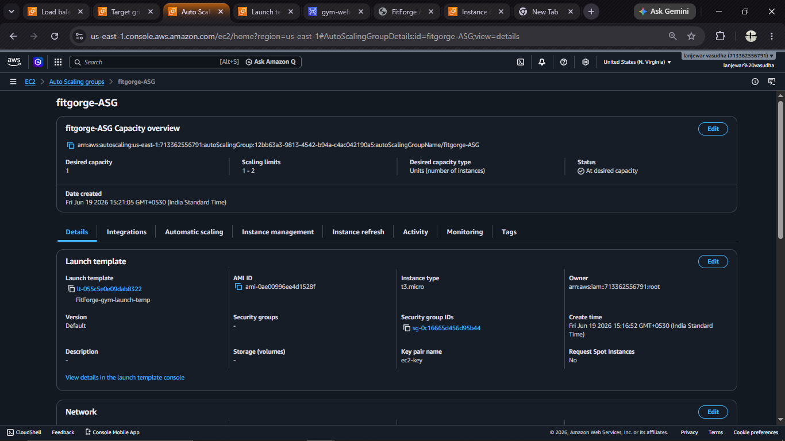

# FitForge Gym Management System 🏋️‍♂️

## Overview

Built and deployed a full-stack Gym Management Web Application on AWS to gain hands-on experience with cloud deployment, database integration, load balancing, auto scaling, and Linux server administration.

## Services Used

* Amazon EC2
* Amazon RDS (MySQL)
* Application Load Balancer (ALB)
* Auto Scaling Group (ASG)
* Amazon Machine Image (AMI)
* Launch Templates
* Security Groups
* GitHub

## Tech Stack

* Python
* Flask
* MySQL
* HTML
* CSS
* JavaScript
* AWS

## Architecture

User → Application Load Balancer → Auto Scaling Group → EC2 (Flask Application) → Amazon RDS MySQL

## What I Built

* Developed a responsive Gym Management Website
* Implemented Membership Registration functionality
* Added Free Trial Booking system
* Created Contact Us form with database integration
* Developed an Admin Dashboard for monitoring records
* Integrated AWS RDS MySQL database
* Deployed the application on Amazon EC2
* Configured Application Load Balancer for traffic distribution
* Implemented Auto Scaling Group for high availability
* Created reusable AMIs and Launch Templates for automated deployments
* Configured systemd service for automatic application startup

## Features

* Membership Registration
* Trial Session Booking
* Contact Form
* BMI Calculator
* Admin Dashboard
* AJAX Form Submission
* Cloud Hosted Database

## Screenshots

### Homepage

### Admin Dashboard

### Database Records

## AWS Resources

### EC2 Instance

### RDS Database

### Application Load Balancer

### Auto Scaling Group

### Target Group Health

.png)

## Skills Demonstrated

AWS • Linux • Python • Flask • MySQL • GitHub • Load Balancing • Auto Scaling • Cloud Deployment • Networking • Troubleshooting

## Challenges Solved

* Debugged RDS connectivity issues between EC2 and Auto Scaling instances
* Configured Security Groups for secure communication
* Implemented automatic application startup using systemd
* Diagnosed and resolved Load Balancer health check failures

---

**Swarup Lanjewar**

Built as part of my Cloud & DevOps learning journey 🚀
